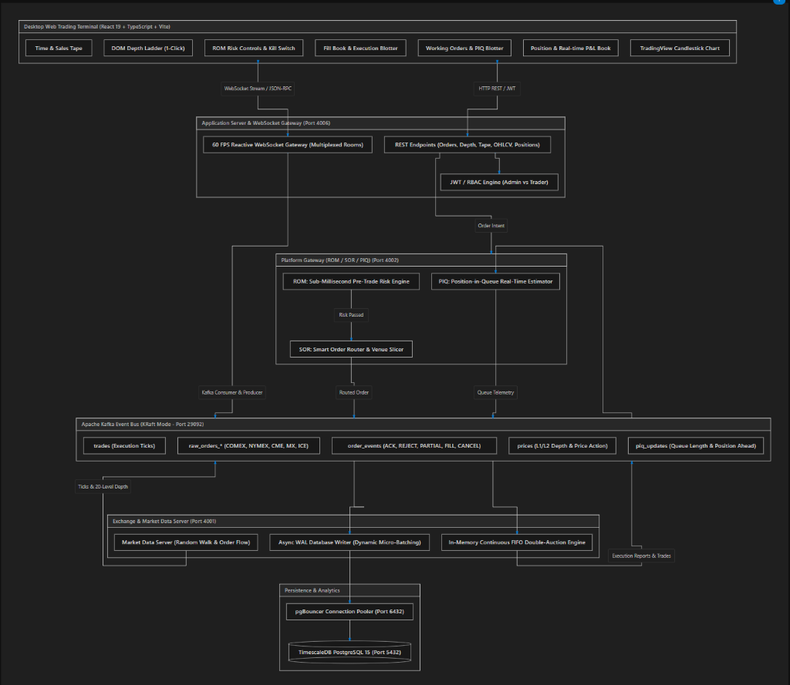

# ⚡ Open Interest — Institutional Multi-Venue Futures Trading Platform

**Open Interest** is an institutional-grade, high-throughput, multi-venue electronic derivatives trading platform and order execution engine. Designed for ultra-low-latency execution, real-time pre-trade risk controls, distributed market data dissemination, and professional multi-window trader workflows modeled after top-tier prop desk terminals (*Trading Technologies / CQG / Bloomberg*).

---

## 🛠️ Core Technology Stack

| Layer / Component | Technologies & Frameworks | Description & Purpose |
| :--- | :--- | :--- |
| **Trading Terminal UI** | `React 19`, `TypeScript`, `Vite`, `Tailwind CSS` | Desktop-grade multi-window window manager with dynamic auto-expanding scroll canvas. |
| **Financial Charting** | `Lightweight-Charts (TradingView)` | Sub-millisecond continuous candlestick charts, volume histograms, and SMA indicators. |
| **Audio Synthesizer** | `Web Audio API` (OscillatorNode) | Procedural zero-asset earcon synthesis for order fills, cancels, and risk rejections. |
| **App Server & Gateway** | `Node.js 18+`, `Express.js`, `ws (WebSocket)` | REST endpoints, JWT auth, and 60 FPS delta-throttled multiplexed WebSocket broadcast feeds. |
| **Security & Auth** | `Bcrypt (10 Rounds)`, `JSON Web Tokens (HS256)` | Role-Based Access Control (Admin vs Trader) with dual username/ID identity resolution. |
| **Matching Engine** | `In-Memory Double-Auction Engine (Node.js)` | Continuous FIFO Price-Time Priority matching with fixed-precision tick arithmetic. |
| **Risk & Routing (ROM/SOR)**| `Pre-Trade Risk Engine`, `Smart Order Router (Node.js)` | Sub-millisecond pre-trade position/margin checks, working order reservation, and queue isolation. |
| **Queue Telemetry (PIQ)** | `Position-in-Queue Estimator (Node.js)` | Real-time queue length tracking ahead of resting orders and exponential fill probability math. |
| **Event Streaming Bus** | `Apache Kafka (v3.7+ KRaft Mode)`, `KafkaJS` | Distributed, partitioned event log for raw orders, execution reports, trades, and depth. |
| **Time-Series Persistence** | `TimescaleDB (PostgreSQL 15)` | Partitioned hypertables with automated continuous aggregates (1s, 1m, 5m, 1h OHLCV). |
| **Connection Pooling** | `pgBouncer 1.21+` | Transaction-mode connection pooling (port 6432) protecting DB from worker exhaustion. |
| **Testing & CI** | `Node.js Native Test Runner (node:test)` | 115 unit, integration, and crash-recovery test suites (100% green pass rate). |
| **Containerization** | `Docker`, `Docker Compose` | Full multi-container orchestration for databases, brokers, gateways, and microservices. |

---

## 📑 Table of Contents

- [🛠️ Core Technology Stack](#️-core-technology-stack)
- [🏛️ System Architecture](#️-system-architecture)
- [📊 Pre-Loaded Global Futures Contracts](#-pre-loaded-global-futures-contracts)
- [🧩 Deep Dive: Implemented Modules & Architecture](#-deep-dive-implemented-modules--architecture)
  - [1. Core Matching Engine & Market Data Service (`exchange/`)](#1-core-matching-engine--market-data-service-exchange)
  - [2. Pre-Trade Risk (ROM), SOR & Queue Estimator (`platform/`)](#2-pre-trade-risk-rom-sor--queue-estimator-platform)
  - [3. Application Server & 60 FPS WebSocket Gateway (`appserver/`)](#3-application-server--60-fps-websocket-gateway-appserver)
  - [4. Desktop Web Trading Terminal Frontend (`frontend/`)](#4-desktop-web-trading-terminal-frontend-frontend)
  - [5. Time-Series Persistence & Connection Pooling (`init-db/`, `pgbouncer.ini`)](#5-time-series-persistence--connection-pooling-init-db-pgbouncerini)
- [🛡️ Enterprise System Hardening & Fault Tolerance Architecture](#️-enterprise-system-hardening--fault-tolerance-architecture)
  - [Exchange Service Hardening](#1-exchange-matching-engine--market-data-service-hardening)
  - [Platform Gateway & Risk Hardening](#2-platform-gateway--pre-trade-risk-hardening)
  - [AppServer & WebSocket Gateway Hardening](#3-appserver--websocket-gateway-hardening)
  - [Database & Storage Layer Hardening](#4-database--persistence-layer-hardening)
  - [Frontend Terminal UI Hardening](#5-frontend-terminal-resiliency--hardening)
- [🚀 Microservices Port Matrix](#-microservices-port-matrix)
- [🛠️ Quick Start & Local Setup](#️-quick-start--local-setup)
- [🧪 Test Suites & Verification (115/115 Green)](#-test-suites--verification-115115-green)
- [🤖 Multi-Trader Algorithmic Simulation](#-multi-trader-algorithmic-simulation)
- [🔐 Security, RBAC & Sanitation](#-security-rbac--sanitation)
- [🏷️ Badges & Project Status](#️-badges--project-status)
- [📄 License](#-license)

---

## 🏛️ System Architecture

<p align="center">
  
</p>

---

## 📊 Pre-Loaded Global Futures Contracts

The platform features 5 benchmark futures contracts across global electronic derivatives exchanges, fully pre-seeded with institutional lot sizes, tick dimensions, and contract multipliers:

| Symbol | Description | Venue / Exchange | Family | Tick Size | Lot Size | Contract Multiplier | Initial Mark Price |
| :--- | :--- | :--- | :--- | :--- | :--- | :--- | :--- |
| **`GC Dec27`** | Gold Futures Dec 2027 | **COMEX** | Precious Metals | `0.1000` | 1 | $100 / oz | \$2,650.00 |
| **`CL Dec27`** | Crude Oil Futures Dec 2027 | **NYMEX** | Energies | `0.0100` | 1 | 1,000 barrels | \$78.50 |
| **`SR3 Dec27`** | 3-Month SOFR Futures Dec 2027 | **CME** | Short-Term Interest Rates | `0.0050` | 1 | $2,500 / point | 96.0350 |
| **`CRA Dec27`** | CORRA Rate Futures Dec 2027 | **MX** | CAD Interest Rates | `0.0050` | 1 | $2,500 / point | 95.8200 |
| **`ER3 Jun26`** | €STR 3-Month Rate Futures Jun 2026 | **ICE** | EUR Interest Rates | `0.0050` | 1 | €2,500 / point | 97.2100 |

---

## 🧩 Deep Dive: Implemented Modules & Architecture

### 1. Core Matching Engine & Market Data Service (`exchange/`)
The exchange service acts as the central electronic execution venue for all order flows, executing continuous double-auction price matching, simulating institutional order flow, and asynchronously committing WAL records.

- **In-Memory FIFO Continuous Double Auction Matching Engine (`engine.js`)**:
  - **High-Performance Price-Time Priority Algorithm**: Sub-millisecond order book matching where incoming aggressive orders sweep opposite resting liquidity levels in price order (highest bid / lowest ask), executing against resting orders in exact arrival timestamp order (FIFO).
  - **Discrete Integer-Tick Arithmetic (`priceToTicks`, `ticksToPrice`)**: Eliminates IEEE-754 floating-point rounding inaccuracies by discretizing all order prices into integer tick multiples based on instrument-specific tick sizes (`0.10000` for COMEX Gold, `0.01000` for NYMEX Crude, `0.00500` for Interest Rates).
  - **Complete Order Type Suite**:
    - `LIMIT`: Places passive liquidity in the book at the target limit price or matches crossing opposite liquidity.
    - `MARKET`: Sweeps all available crossing depth immediately at the best available prices; unfilled remainders are cancelled.
    - `STOP_LIMIT`: Triggers an active limit order when the market last traded price reaches or breaches the stop trigger price.
    - `GTD` (Good-Till-Date/Time): Supports exact millisecond timestamps after which resting orders are automatically expired.
  - **Time-In-Force (TIF) Execution Policies**:
    - `DAY` / `GTC` (Good-Till-Cancelled): Rests unfilled quantities in the order book.
    - `IOC` (Immediate-Or-Cancel): Executes available crossing liquidity immediately and cancels any unfilled remainder.
    - `FOK` (Fill-Or-Kill): Pre-computes total crossing liquidity across all qualifying depth levels; if the full quantity cannot be filled immediately, the entire order is rejected with zero partial execution.
  - **Self-Trade Prevention (STP)**: Detects when incoming and resting orders share the same `traderId`, automatically rejecting the aggressive order with `STP_SELF_TRADE_PREVENTED` to enforce regulatory market integrity and prevent wash-trading.
  - **In-Place Queue Decrements (Zero FIFO Penalty)**: Partial fills decrement the resting order's quantity in-place without removing or re-inserting the order, ensuring resting traders retain their head-of-queue priority.
  - **O(1) Order Lookup & Cancellation Index**: Maintains an in-memory `orders` Map indexed by `orderId` for instantaneous $O(1)$ order cancellations, level queue splices, and empty-tier garbage collection.
  - **Sliding-Window Idempotency Cache**: Tracks processed order IDs with an automated 60-second sliding cleaner that evicts timestamps older than 1 hour, preventing duplicate message processing while bounding memory overhead.
  - **L2 20-Level Depth Aggregation**: Extracts instantaneous 20-tier Bid and Ask ladders with aggregated contract quantities and resting order counts per price tick.

- **Hybrid Market Data Service & Synthetic Flow Engine (`mds.js`)**:
  - **Dual Operating Modes**:
    - `RANDOM_WALK` (Default Simulation Mode): Injects automated institutional two-sided liquidity and realistic price discovery.
    - `USER_DRIVEN` (Deterministic Mode): Clears all synthetic market-maker quotes and relies purely on live trader orders and external algorithmic bots.
  - **Geometric Brownian Motion with Mean-Reverting Pull**:
    - Simulates authentic high-frequency price fluctuations with stochastic tick drifts ($\Delta t \in [-3, +3]$ ticks).
    - Enforces elastic mean-reversion pull when price drifts $>5\%$ from baseline contract mark prices.
    - Bounds price oscillations within a strict $\pm 10\%$ daily circuit breaker band.
  - **Dynamic Cancel-and-Replace Market Making**: Continuously maintains 5-level Bid and 5-level Ask depth ladders around the moving mid-price, dynamically replacing quotes every 1,500ms with randomized lot sizes ($5$ to $25$ lots).
  - **Zero-Pollution Mode Switching (`POST /admin/mds/mode`)**: Switching to `USER_DRIVEN` mode purges all active synthetic quotes (`activeQuotes`) from the order book while leaving all human/bot trader resting orders completely untouched.
  - **Real-Time Kafka Market Data Feeds**: Disseminates sub-millisecond price ticks, BBO spreads, 24-hour high/low metrics, and aggregated 20-level L2 depth updates to the `prices` Kafka topic.

- **Resilient Async WAL DB Writer (`db-writer.js`)**:
  - **Decoupled Asynchronous Persistence**: Decouples disk I/O and PostgreSQL write latency from the matching engine critical path by buffering trade executions, price ticks, and order state events in memory.
  - **Dynamic Micro-Batching**: Automatically flushes buffered records when buffer size reaches 500 items or when the 100ms periodic flush timer expires.
  - **Zero-Data-Loss In-Memory Requeuing**: If a database transaction fails due to a network glitch or pool timeout, the transaction rolls back cleanly, and uncommitted items are atomically re-prepended to the front of the write queue to retry on the next cycle.
  - **ACID Transactional Portfolio & Realized P&L Accounting (`_updatePositionInTx`)**:
    - Executes row-locked atomic updates (`SELECT ... FOR UPDATE`) in PostgreSQL.
    - Automatically accounts for contract multipliers (e.g., $100 for COMEX Gold, $1,000 for NYMEX Crude, $2,500 for 3M SOFR/CORRA/ESTR).
    - Computes real-time weighted average open price (`avg_px`), cumulative buy/sell quantities, net position (`net_pos`), and realized profit/loss (`realized_pl`).

- **Exchange Server Lifecycle & Multi-Venue Event Bus (`server.js`)**:
  - **Multi-Venue Kafka Ingestion**: Manages dedicated consumer groups subscribing to venue-specific topics: `raw_orders_comex`, `raw_orders_nymex`, `raw_orders_cme`, `raw_orders_mx`, and `raw_orders_ice`.
  - **Automated Topic Provisioning**: Automatically verifies and creates all 12 platform Kafka topics on boot if missing.
  - **Cold-Start Session Volume Hydration**: On startup, aggregates historical intraday trades from PostgreSQL to restore daily cumulative trading volumes for each contract into memory.
  - **Direct REST Management API (Port 4001)**: Exposes low-latency administrative and diagnostic endpoints (`/health`, `/depth/:instrument`, `/tape/:instrument`, `/admin/mds/mode`, `/order`).

---

### 2. Pre-Trade Risk (ROM), SOR & Queue Estimator (`platform/`)
The platform service serves as the institutional gateway layer enforcing regulatory and internal risk controls prior to order arrival at matching venues.

- **Risk Order Manager (`rom/riskEngine.js`)**:
  - **Pre-Trade Invariant Validation**:
    - **ROM-01 (Max Position Limit)**: Evaluates projected long exposure ($\text{netPos} + \text{workingBuys} + \text{orderQty} \le \text{maxPosition}$) and projected short exposure ($|\text{netPos} - \text{workingSells} - \text{orderQty}| \le \text{maxPosition}$) in sub-millisecond memory.
    - **ROM-02 (Max Notional Limit)**: Evaluates contract multiplier-adjusted notional value ($\text{orderQty} \times \text{price} \times \text{multiplier} \le \text{maxNotional}$).
    - **Order Quantity Caps**: Distinguishes outright volume limits (`max_order_qty_outrights`) from multi-leg calendar spreads (`max_order_qty_spreads`).
    - **Instant Kill Switches**: Emergency trading suspension (`trade_allowed = false`) callable by administrators or automated circuit breakers, immediately rejecting subsequent orders with `TRADING_SUSPENDED_BY_ADMIN`.
  - **Optimistic Working-Order Margin Reservation (`reserveWorkingMargin`)**:
    - Sub-millisecond reservation of buying power (`workingBuys` / `workingSells`) upon order ingress.
    - Prevents race-condition order floods where multiple rapid orders exceed account margin capacity before matches execute.
  - **Trade Fill Reconciliation & Position P&L Math (`onTrade`)**:
    - Updates cumulative buy/sell quantities and releases `workingBuys`/`workingSells` margin reservations.
    - Computes real-time weighted average open price:
      $$\text{avgPx}_{\text{new}} = \frac{\text{netPos} \times \text{avgPx} + \text{tradeQty} \times \text{tradePrice}}{\text{netPos} + \text{tradeQty}}$$
    - Computes realized P&L on closing or flipping positions:
      $$\text{realizedPnl} += (\text{avgPx} - \text{tradePrice}) \times \text{closingQty} \times \text{multiplier} \quad (\text{Short Closes})$$
      $$\text{realizedPnl} += (\text{tradePrice} - \text{avgPx}) \times \text{closingQty} \times \text{multiplier} \quad (\text{Long Closes})$$
  - **Cold-Start Crash Recovery & State Hydration (`loadLimitsFromDb`, `loadPositionsFromDb`)**:
    - On platform startup/reboot, queries `risk_limits` and `positions` tables from PostgreSQL before opening Kafka consumers.
    - Restores in-memory position state, average prices, and risk configurations, preventing the "zero-reset" vulnerability.
  - **Dynamic Monotonic Versioning Concurrency Control**:
    - Risk limit modifications carry monotonic `limit_version` numbers, preventing race conditions during concurrent administrative updates.

- **Smart Order Router (`sor/router.js`)**:
  - **EX-05 Venue Topic Isolation**: Deterministically routes validated orders to venue-specific Kafka queues:
    - `GC Dec27` $\to$ `raw_orders_comex` (COMEX)
    - `CL Dec27` $\to$ `raw_orders_nymex` (NYMEX)
    - `SR3 Dec27` $\to$ `raw_orders_cme` (CME)
    - `CRA Dec27` $\to$ `raw_orders_mx` (MX)
    - `ER3 Jun26` $\to$ `raw_orders_ice` (ICE)
  - **Unknown Symbol Guard & Dead-Letter Routing**: If an unmapped instrument is received, reroutes the payload to the `dead_letter` topic with an immediate `UNKNOWN_VENUE` rejection event.
  - **Order Schema Normalization**: Enforces strict typing, generates unique UUIDs if omitted, and formats order payloads.
  - **Cancellation Routing**: Directs cancellation requests (`CANCEL`) to the exact venue queue hosting the resting order.

- **Position-in-Queue Telemetry & Probability Engine (`piq/piqEngine.js`)**:
  - **Dual Indexing Architecture**:
    - Primary Index (`trackedOrders` Map): $O(1)$ order retrieval by `orderId`.
    - Secondary Price Bucket Index (`ordersByLevel` Map): Keyed by `${instrument}:${price}` pointing to a `Set` of order IDs for targeted queue traversal without full memory scans.
  - **EX-06 Fill Priority & Telemetry**:
    - Tracks resting limit order position in queue (`aheadQty`).
    - Continuously decrements `aheadQty` on execution ticks and cancellations occurring at the same price level.
    - Computes dynamic Fill Probability via exponential decay:
      $$P = \exp\left(-\frac{\text{aheadQty}}{\text{levelDepth} + 1}\right) \times \frac{1}{1 + \text{distanceTicks}}$$
    - Broadcasts live queue telemetry packets over the `piq_updates` Kafka topic.

---

### 3. Application Server & 60 FPS WebSocket Gateway (`appserver/`)
The application server bridges external clients to the distributed Kafka event pipeline and TimescaleDB analytical store.

- **60 FPS Reactive WebSocket Gateway (`ws/gateway.js`)**:
  - **Multiplexed Channel Pub/Sub**: Single persistent TCP connection multiplexing public and private rooms.
  - **Room Routing Matrix**:
    - Public: `depth:<symbol>`, `trades:<symbol>`, `ticker:<symbol>`, `ohlcv:<symbol>`.
    - Private: `trader:<trader_id>` (pushes execution reports, fill confirmations, margin rejection alerts).
  - **Multi-Tier Authentication & Security Boundary**:
    - URL query parameter JWT handshake validation (`/ws?token=<JWT>`).
    - Post-connection in-flight `AUTH` payload message authentication.
    - Strict channel authorization: Rejects non-admin users attempting to subscribe to private channels of other traders (`AUTH_FAILED: Unauthorized trader channel access`).
  - **Native Sub-Millisecond WebSocket Order Entry**: Direct JSON bi-directional protocol (`ORDER_NEW`, `ORDER_CANCEL`) validating payloads and publishing straight to Kafka `orders`.
  - **60 FPS Delta Throttling & UI Protection**: Micro-buffers market depth updates into 16ms animation frame batches, preventing client browser render-thread locking during high-frequency volatility bursts.
  - **Active Connection Health & Heartbeat Pruning**: 30-second `PING`/`PONG` heartbeat sweeps with automatic cleanup of zombie TCP sockets.
- **Institutional JWT & RBAC Engine (`routes/auth.js`)**:
  - Secure bcrypt password hashing with 10 salt rounds.
  - Dual identity resolution supporting login via either username (`admin`, `trader1`, `trader2`) or Account ID (`admin_1`, `trader_1`, `trader_2`).
  - Role-Based Access Control middleware enforcing strict operational boundaries between `ADMIN` and `TRADER` accounts.
  - Double-Quoted `.env` Configuration: Prevents `#` inline comment truncation in environment variables.
- **Market Data & Time-Series APIs (`routes/market.js`)**:
  - `GET /api/market/instruments`: Contract metadata, lot sizes, tick sizes, multipliers, exchange venues.
  - `GET /api/market/depth/:instrument`: Queries Exchange for real-time 20-level aggregated depth snapshot.
  - `GET /api/market/tape/:instrument`: Queries TimescaleDB `trades` / `trades_hyper` for recent Time & Sales trade tick stream.
  - `GET /api/market/ohlcv/:instrument`: Continuous aggregate candlestick bars (`candlesticks_1s`, `candlesticks_1m`, `candlesticks_5m`, `candlesticks_1h`) with time range filtering.
- **Trading & Portfolio Blotter APIs (`routes/trading.js`)**:
  - `POST /api/trading/order`: Order entry endpoint with schema validation, PostgreSQL persistence, and Kafka forwarding.
  - `DELETE /api/trading/order/:orderId`: Atomic order cancellation.
  - `GET /api/trading/orders`: Working orders blotter with active state tracking (`NEW`, `PARTIALLY_FILLED`).
  - `GET /api/trading/trades`: Historical executed fills blotter for authenticated trader.
  - `GET /api/trading/positions`: Real-time net positions, weighted average open prices, realized P&L, and unrealized mark-to-market valuations.
- **Administrative Risk & Trader Control APIs (`routes/admin.js`)**:
  - `GET /api/admin/traders`: List all registered traders and desk accounts.
  - `POST /api/admin/limits`: Live modification of trader risk parameters (persisted to PostgreSQL with monotonic `limit_version` increment and published to Kafka `risk_events`).
  - `GET /api/admin/limits/:trader_id`: Query active risk parameters and limit version numbers.

---

### 4. Desktop Web Trading Terminal Frontend (`frontend/`)
A responsive, high-frequency React 19 + TypeScript + Vite trading application designed for single-monitor and multi-monitor trading desks.

- **Institutional Window Manager & Canvas Engine (`WindowWrapper.tsx`, `DockTaskbar.tsx`)**:
  - **Multi-Window Operating System UX**: Drag, resize, minimize to dock, maximize, and stack widgets with dynamic z-index elevation.
  - **Auto-Expanding / Auto-Shrinking Scrollable Canvas**: The canvas boundary automatically calculates aggregate bounding boxes of all open widgets, seamlessly expanding when a window is dragged beyond the screen edge and contracting when returned or closed.
  - **Persistent Workspace Layouts**: Window coordinates (`x`, `y`), dimensions (`width`, `height`), `isMinimized`, `isMaximized`, and active instruments are automatically synchronized to `localStorage` with fallback schema recovery.
- **10 Professional Trading Widgets**:
  1. **DOM / Price Ladder (`LadderWidget.tsx`)**: Professional Trading Technologies-style vertical depth ladder with static centered price column, single-click limit order placement on Bid/Ask columns, working order markers, cumulative volume bars, and 1-click cancel buttons.
  2. **Candlestick Chart (`ChartWidget.tsx`)**: Lightweight-Charts powered interactive candlestick visualization with live tick streaming, volume histograms, 20-period Simple Moving Average (SMA), crosshairs, and multi-timeframe toggles (1s, 1m, 5m, 15m, 1h).
  3. **Order Book Depth (`OrderBookWidget.tsx`)**: 20-level aggregated Bid/Ask depth table with real-time volume depth bars, spread calculation in ticks and currency, and visual flash highlights on order book updates.
  4. **Order Entry Ticket (`OrderTicketWidget.tsx`)**: Fast order placement ticket supporting Market, Limit, Stop-Limit, and GTD orders, quick size steppers, Time-In-Force options (`DAY`, `GTC`, `IOC`, `FOK`), and dynamic required margin estimation.
  5. **Position Book Blotter (`PositionBookWidget.tsx`)**: Real-time portfolio blotter displaying Start-of-Day position (`sod_pos`), buy/sell volume, net open position (`net_pos`), average open price, mark-to-market unrealized P&L, realized P&L, and 1-click **"Flatten All"** emergency market liquidation.
  6. **Working Orders & PIQ Blotter (`OrderBookWidget.tsx` tab)**: Active order blotter with order states (`NEW`, `PARTIAL_FILL`), live Position-in-Queue (`PIQ`) counters showing contracts ahead in the book, fill probability indicator, and instant cancellation buttons.
  7. **Fill Book Execution Blotter (`FillBookWidget.tsx`)**: Complete historical trade fills blotter with timestamps, side indicators, filled prices, quantities, trade IDs, and trader filtering (in Admin mode).
  8. **Time & Sales Tape (`TimeAndSalesWidget.tsx`)**: High-frequency streaming trade tape with green uptick (buyer-initiated), red downtick (seller-initiated), volume bars, and microsecond timestamps.
  9. **Risk Limits Blotter (`RiskLimitsWidget.tsx`)**: Real-time risk monitor displaying long/short utilization meters, order size constraints, kill switch status, and admin controls for adjusting risk parameters.
  10. **Fill Alert System & Web Audio Engine (`FillAlertWidget.tsx`, `useAudioAlerts.ts`, `utils/audio.ts`)**: Procedurally synthesized Web Audio sound effects (distinct frequencies for Order Placement [880Hz], Trade Fill [587Hz $\to$ 880Hz chime], Order Cancel [440Hz], and Risk Reject [220Hz buzz]) accompanied by toast notifications.

---

### 5. Time-Series Persistence & Connection Pooling (`init-db/`, `pgbouncer.ini`)
- **PostgreSQL 15 & TimescaleDB Hypertables (`init-db/01_schema.sql`, `init-db/02_timescaledb.sql`)**:
  - `trades_hyper` & `prices_hyper` hypertables partitioned into optimized time chunks for instantaneous millisecond range queries over millions of tick rows.
  - **TimescaleDB Continuous Aggregates**: Automatically maintained materialized views computing real-time `candlesticks_1s`, `candlesticks_1m`, `candlesticks_5m`, and `candlesticks_1h` OHLCV bars using `time_bucket()`, `FIRST()`, `MAX()`, `MIN()`, `LAST()`, and `SUM()`.
  - **Automated Compression & Chunk Retention**: Background workers compress historical chunks to minimize disk footprint while keeping all historical tick data queryable.
- **pgBouncer Connection Pooler (`pgbouncer.ini`)**:
  - High-performance transaction pooling running on port `6432`.
  - Configured with `max_client_conn = 1000`, `default_pool_size = 20`, and `reserve_pool_size = 5`.
  - Maintains lightweight client connections, shielding TimescaleDB from connection exhaustion during high-concurrency order spikes and high-frequency trading bursts.

---

## 🛡️ Enterprise System Hardening & Fault Tolerance Architecture

Across every tier of the Open Interest platform, institutional fault tolerance, zero-data-loss resiliency, and defense-in-depth security hardenings are enforced:

```
┌────────────────────────────────────────────────────────────────────────────────────────┐
│                                SYSTEM HARDENING MATRIX                                 │
├───────────────────┬────────────────────────────────────────────────────────────────────┤
│ Microservice      │ Hardening & Resiliency Mechanisms Applied                          │
├───────────────────┼────────────────────────────────────────────────────────────────────┤
│ 1. Exchange       │ • Fixed-precision price tick discretization (No IEEE-754 drifts)   │
│    Matching Engine│ • Write-Ahead Log (WAL) with in-memory retry buffer (Zero Data Loss│
│    & MDS          │ • Deterministic monotonic sequence tracking (`seq_id`, `trade_id`) │
│                   │ • Dynamic MDS mode isolation (User-driven vs Automated Simulation) │
│                   │ • Graceful SIGINT/SIGTERM shutdown traps with buffer flush         │
├───────────────────┼────────────────────────────────────────────────────────────────────┤
│ 2. Platform       │ • Sub-millisecond pre-trade margin & hard position ceiling checks  │
│    Gateway (ROM,  │ • Optimistic in-flight working order buying power reservation      │
│    SOR, PIQ)      │ • Cold-start database state hydration (Limits & Position recovery) │
│                   │ • Monotonic limit versioning (`limit_version`) concurrency lock    │
│                   │ • Outright vs synthetic spread order validation and isolation      │
│                   │ • Instant global & desk-level emergency Kill Switches              │
├───────────────────┼────────────────────────────────────────────────────────────────────┤
│ 3. Application    │ • pgBouncer transaction connection pooling (prevents exhaustion)   │
│    Server & WS    │ • Bcrypt 10-round salted password hashing & parameterized upserts  │
│    Gateway        │ • Dual identity resolution: Case-insensitive username OR trader ID │
│                   │ • Multi-tier WS auth (Handshake token + dynamic `AUTH` frames)     │
│                   │ • Strict channel isolation: Unauthorized private feeds blocked     │
│                   │ • 60 FPS (16ms) depth delta throttling (prevents UI thread lock)   │
│                   │ • PING/PONG heartbeat health monitoring & dead socket cleanup      │
│                   │ • Dotenv double-quote escaping against inline comment truncation   │
├───────────────────┼────────────────────────────────────────────────────────────────────┤
│ 4. Storage &      │ • TimescaleDB partitioned hypertables with automated chunking      │
│    Database       │ • Pre-computed continuous aggregates for 1s/1m/5m/1h candlesticks  │
│    Layer          │ • pgBouncer transaction-level reuse with keep-alives and timeouts  │
│                   │ • Apache Kafka KRaft architecture with zero ZooKeeper dependency   │
├───────────────────┼────────────────────────────────────────────────────────────────────┤
│ 5. Frontend       │ • Dynamic auto-expanding/contracting scrollable canvas containment │
│    Trading UI     │ • Zero-asset procedural Web Audio synthesizer for trade earcons    │
│                   │ • Resilient `localStorage` state recovery with schema fallback     │
│                   │ • Auto-reconnecting WebSocket client with exponential backoff      │
└───────────────────┴────────────────────────────────────────────────────────────────────┘
```

### 1. Exchange Matching Engine & Market Data Service Hardening
- **Fixed-Precision Discretized Arithmetic**: All order matching, price increments, and depth calculations enforce strict contract tick size discretization (`0.100`, `0.010`, `0.005`), completely eliminating floating-point rounding drifts common in naive matching engines.
- **Asynchronous WAL Micro-Batching with Zero Data Loss**: Database I/O is decoupled from matching loops using an in-memory buffer. If PostgreSQL or TimescaleDB experiences a transient network drop or transaction failure, the uncommitted records are automatically caught, rolled back, and safely re-queued to the head of the buffer with exponential retry backoff.
- **Deterministic Monotonic Sequencing**: All execution reports, order state transitions, and trade ticks carry monotonically increasing sequence numbers (`seq_id`) to ensure deterministic event replay across downstream consumers.
- **Mode-Isolated Market Data Dissemination**: The MDS engine features dual operating modes (`SIMULATION` and `USER_DRIVEN`). Switching modes atomically cancels synthetic market-maker quotes without corrupting or flushing real user-submitted limit orders.
- **Clean Signal Interception**: Intercepts `SIGINT` and `SIGTERM` signals to flush lingering persistence batches, stop MDS intervals, and close Kafka connections gracefully.

### 2. Platform Gateway & Pre-Trade Risk Hardening
- **Sub-Millisecond Pre-Trade Risk Checks (ROM)**: Rejects unauthorized, non-compliant, or margin-exhausting orders before they ever touch the exchange Kafka queues.
- **Optimistic Working-Order Risk Accounting**: When a limit order is resting in the order book, its exposure is reserved in real-time. High-frequency order bursts cannot bypass account margin limits while waiting for executions.
- **Cold-Start Crash Recovery & State Hydration**: Upon reboot or crash recovery, the platform queries the `risk_limits` and `positions` tables in PostgreSQL to hydrate all trader limits and historical net open positions before accepting any inbound order traffic. This eliminates the catastrophic "zero-reset" vulnerability where a service restart would clear open positions and risk controls.
- **Monotonic Versioning Concurrency Control**: Risk limit modifications carry monotonic `limit_version` numbers, preventing race conditions or stale writes during concurrent administrative updates.
- **Emergency Kill Switches**: Instant trading suspension (`trade_allowed = false`) blocks all subsequent order entry and allows instantaneous desk-level risk freezes.

### 3. AppServer & WebSocket Gateway Hardening
- **pgBouncer Connection Shield**: Database queries route through pgBouncer transaction pooling (port 6432), protecting the TimescaleDB backend from connection starvation during volatile trading spikes.
- **Cryptographic RBAC & Parameterized Upserts**: All passwords are encrypted with bcrypt (10 rounds). User creation uses parameterized `ON CONFLICT (username) DO UPDATE` queries to prevent SQL injection and race conditions during seed migrations.
- **Dual Identity Resolution**: Authenticates users by either username (`admin`, `trader1`, `trader2`) or Account ID (`admin_1`, `trader_1`, `trader_2`), normalizing logins across both naming conventions.
- **Strict WebSocket Channel Isolation**: Every WebSocket subscription to private rooms (e.g. `trader:<trader_id>`) is verified against the socket's authenticated JWT identity. Cross-trader snooping is rejected with immediate auth error frames.
- **60 FPS Delta Throttling**: High-frequency order book updates and trade streams are throttled to 16ms animation frame windows, preventing client browser main-thread freezes.
- **Heartbeat Connection Pruning**: Bi-directional `PING`/`PONG` frames automatically purge dead or half-open TCP connections.
- **Dotenv Quotation Safeguard**: All credentials containing special characters (`#`, `@`, `!`) in `.env` are double-quote wrapped, preventing the `dotenv` parser from truncating passwords at `#` inline comment tokens.

### 4. Database & Persistence Layer Hardening
- **TimescaleDB Partitioned Hypertables**: The `trades_hyper` and `prices_hyper` tables are partitioned into time chunks, enabling lightning-fast range queries and efficient data retention policies over millions of tick rows.
- **Continuous Aggregates**: Real-time 1-second, 1-minute, 5-minute, and 1-hour OHLCV candlesticks are materialized automatically by background workers, eliminating compute-heavy runtime grouping queries on the API server.
- **KRaft Kafka Architecture**: Eliminates ZooKeeper single-point-of-failure vulnerabilities with high-performance KRaft metadata quorum.

### 5. Frontend Terminal Resiliency & Hardening
- **Dynamic Viewport Containment Engine**: The custom window manager continuously computes bounding boxes for all 10 widgets. Moving a widget past the screen edge seamlessly expands the scrollable canvas; moving it back or closing it automatically contracts the canvas to prevent viewport drift.
- **Procedural Zero-Asset Audio Engine**: Order entry, trade fill, cancellation, and risk rejection audio alerts are synthesized directly via the Web Audio API, eliminating external audio asset download latency and 404 network failures.
- **Resilient Layout Persistence**: Workspace configurations (coordinates, dimensions, z-indices, active instruments) are serialized with schema versioning to `localStorage`, falling back gracefully to clean defaults if corrupted.
- **Auto-Reconnecting WebSocket Stream**: Sockets automatically reconnect with jittered exponential backoff upon network disconnection and resubscribe to all active room channels.

---

## 🚀 Microservices Port Matrix

| Service | Directory | Container Port | Host Port | Protocol | Description |
| :--- | :--- | :--- | :--- | :--- | :--- |
| **Exchange** | [`/exchange`](file:///D:/OpenInterest/open-interest/exchange) | `4001` | `4001` | HTTP / Kafka | Core FIFO Matching Engine, MDS & DB Writer |
| **Platform** | [`/platform`](file:///D:/OpenInterest/open-interest/platform) | `4002` | `4002` | HTTP / Kafka | Pre-Trade Risk (ROM), SOR & PIQ Gateway |
| **AppServer** | [`/appserver`](file:///D:/OpenInterest/open-interest/appserver) | `4006` | `4006` | HTTP / WebSocket | REST APIs, JWT Auth & 60 FPS WebSocket Gateway |
| **Frontend** | [`/frontend`](file:///D:/OpenInterest/open-interest/frontend) | `80` | `5173` / `80` | HTTP / WS Proxy | React 19 Trading UI (Vite dev server / Nginx prod) |
| **pgBouncer** | [`/pgbouncer.ini`](file:///D:/OpenInterest/open-interest/pgbouncer.ini) | `6432` | `6432` | PostgreSQL | Transaction Connection Pooler |
| **TimescaleDB** | [`/init-db`](file:///D:/OpenInterest/open-interest/init-db) | `5432` | `5432` | PostgreSQL | PostgreSQL 15 + TimescaleDB Hypertables |
| **Kafka Broker** | — | `9092` | `29092` | TCP (KRaft) | Distributed Event Streaming Log (ZooKeeper-free) |
| **Kafka UI** | — | `8080` | `8080` | HTTP | Web console for Kafka topics & consumer groups |

---

## 🛠️ Quick Start & Local Setup

### Prerequisites
- [Docker](https://www.docker.com/) (v24+) & Docker Compose
- [Node.js](https://nodejs.org/) (v18.x or v20.x) and `npm`

### 1. Clone & Configure Environment
```bash
git clone https://github.com/<your-username>/open-interest.git
cd open-interest

# Copy the sanitized environment template
cp .env.example .env
```

### 2. Start Core Infrastructure Containers
```bash
npm run docker:up
```
Verify all 4 infrastructure containers are healthy:
- TimescaleDB: `localhost:5432`
- pgBouncer Pooler: `localhost:6432`
- Kafka Broker: `localhost:29092`
- Kafka UI Dashboard: `http://localhost:8080`

### 3. Install All Dependencies
```bash
npm run install:all
```

### 4. Start Microservices in Development Mode
You can start each service in separate terminal windows:

```bash
# Terminal 1: Exchange Matching Engine & MDS
npm run dev:exchange

# Terminal 2: Platform Risk (ROM), Router (SOR), and Queue (PIQ)
npm run dev:platform

# Terminal 3: AppServer & WebSocket Gateway
npm run dev:appserver

# Terminal 4: Web Trading Terminal Frontend
npm run dev:frontend
```

Open **`http://localhost:5173`** in your browser to start trading!

---

## 🧪 Test Suites & Verification (115/115 Green)

Open Interest features a comprehensive **115-test automated test suite** across all microservices:

```bash
# Run all test suites across Exchange, Platform, and AppServer in parallel:
npm run test:all
```

### Individual Service Test Suites:

```bash
# 1. Exchange Test Suite (25/25 Tests Passed)
# Tests FIFO matching, price-time priority, market data aggregation, & WAL batch persistence
npm run test:exchange

# 2. Platform Test Suite (38/38 Tests Passed)
# Tests ROM pre-trade margin/position limits, SOR routing, PIQ estimators, and DB risk persistence/crash-recovery
npm run test:platform

# 3. AppServer Test Suite (52/52 Tests Passed)
# Tests pgBouncer pooling, bcrypt/JWT auth, REST routes, seed logins, & 60 FPS WebSocket multi-room broadcasts
npm run test:appserver
```

---

## 🤖 Multi-Trader Algorithmic Simulation

To test realistic multi-participant market dynamics, launch the automated algorithmic trading simulation. It spawns 10 concurrent algorithmic trading agents across diverse market archetypes:
- **Market Makers**: Continuously post two-sided quotes around the BBO with dynamic spreads.
- **Scalpers**: High-frequency liquidity takers hunting micro-rebates and momentum ticks.
- **Momentum Traders**: Trend-following algorithms submitting aggressive breakout market orders.
- **Arbitrageurs**: Exploiting cross-contract synthetic spread discrepancies.

```bash
npm run simulate:platform
```

---

## 🔐 Security, RBAC & Sanitation

- **Role-Based Access Control**: Strict privilege separation between `ADMIN` (system configuration, global risk limit adjustments, trader kill switch) and `TRADER` (order placement, working order blotters, personal portfolio tracking).
- **Sub-Millisecond Pre-Trade Risk Verification**: Orders exceeding margin capacity or risk limits are blocked at the platform layer before reaching the exchange matching book.
- **Zero Credential Leaks**: All database passwords, JWT secrets, and broker connection strings are completely externalized into `.env` and strictly excluded from Git tracking via `.gitignore`.

---

## 🏷️ Badges & Project Status

[-brightgreen.svg)](#-test-suites--verification-115115-green)
[](LICENSE)
[](https://nodejs.org/)
[](https://www.timescale.com/)
[](https://kafka.apache.org/)
[](https://react.dev/)
[](https://tailwindcss.com/)

---

## 📄 License

This project is licensed under the [MIT License](LICENSE).

